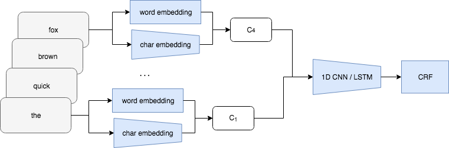

+++
title="Named Entity Recognition in Noisy Domains"
date=2018-02-01
slug="ner-in-noisy-domains"
description="V. Malykh & V. Lyalin. ICAIAI 2018."

[extra]
link = "https://ieeexplore.ieee.org/document/8674438"
link_description = "Paper link"
bibtex = """@INPROCEEDINGS{8674438,  author={Malykh, Valentin and Lyalin, Vladislav},  booktitle={2018 International Conference on Artificial Intelligence Applications and Innovations (IC-AIAI)},   title={Named Entity Recognition in Noisy Domains},   year={2018},  volume={},  number={},  pages={60-65},  doi={10.1109/IC-AIAI.2018.8674438}}"""
+++

Named Entity Recognition (NER) task is an important part for conversational AI. A typical user of a conversation system has no time to check the spelling or grammar in his or her utterances. Due to that user utterances contain typos and spelling errors, so the noise robustness should be considered as a significant aspect of NER task. In this work, we study noise robustness properties for variants of state of the art named entity recognition models on three languages, English on CoNLL'03 corpus, Russian, on Persons-1000 corpus and French, on CAp'2017 corpus, also, we demonstrate state of the art results for CAp'2017.

<!-- more -->



### Citation:
```bibtex
@inproceedings{malykh2018ner,
    author={Malykh, Valentin and Lialin, Vladislav},
    title={Named Entity Recognition in Noisy Domains},
    booktitle={2018 International Conference on Artificial Intelligence Applications and Innovations (IC-AIAI)},
    year={2018},
    pages={60-65},
    doi={10.1109/IC-AIAI.2018.8674438}
}
```
