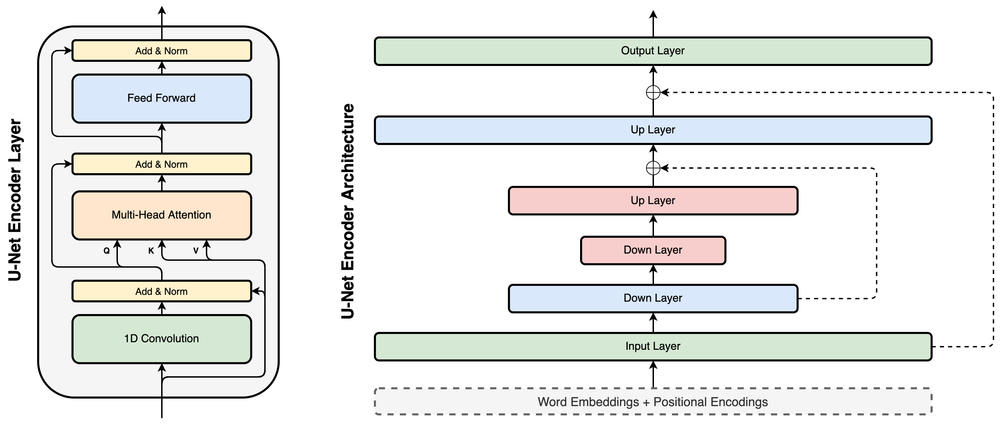

+++
title="Injecting Hierarchy with U-Net Transformers"
date=2019-10-16
slug="unet-transformers"
description="D. Donahue, V. Lialin, A. Rumshisky, 2019"

[extra]
link = "https://arxiv.org/abs/1910.10488"
link_description = "Paper link"
bibtex = """@misc{donahue2019injecting,
    title={Injecting Hierarchy with U-Net Transformers},
    author={David Donahue and Vladislav Lialin and Anna Rumshisky},
    year={2019},
    eprint={1910.10488},
    archivePrefix={arXiv},
    primaryClass={cs.LG}
}"""
+++

The Transformer architecture has become increasingly popular over the past two years, owing to its impressive performance on a number of natural language processing (NLP) tasks. However, all Transformer computations occur at the level of word representations and therefore, it may be argued that Transformer models do not explicitly attempt to learn hierarchical structure which is widely assumed to be integral to language. In the present work, we introduce hierarchical processing into the Transformer model, taking inspiration from the U-Net architecture, popular in computer vision for its hierarchical view of natural images. We empirically demonstrate that the proposed architecture outperforms both the vanilla Transformer and some strong baselines in the domain of chit-chat dialogue.

<!-- more -->



### Citation:
```bibtex
@misc{donahue2019injecting,
    title={Injecting Hierarchy with U-Net Transformers},
    author={David Donahue and Vladislav Lialin and Anna Rumshisky},
    year={2019},
    eprint={1910.10488},
    archivePrefix={arXiv},
    primaryClass={cs.LG}
}
```
