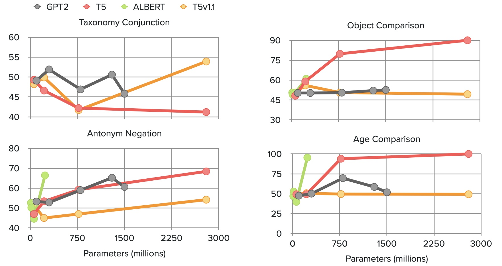

+++
title="Life after BERT: What do Other Muppets Understand about Language?"
date=2022-05-21
slug="life-after-bert"
description="V. Lialin, K. Zhao, Namrata Shivagunde, A. Rumshisky., ACL 2022"

[extra]
link = "https://aclanthology.org/2022.acl-long.227/"
link_description = "Paper link"
+++

Existing pre-trained transformer analysis works usually focus only on one or two model families at a time, overlooking the variability of the architecture and pre-training objectives. In our work, we utilize the oLMpics bench- mark and psycholinguistic probing datasets for a diverse set of 29 models including T5, BART, and ALBERT. Additionally, we adapt the oLMpics zero-shot setup for autoregres- sive models and evaluate GPT networks of different sizes. Our findings show that none of these models can resolve compositional questions in a zero-shot fashion, suggesting that this skill is not learnable using existing pre-training objectives. Furthermore, we find that global model decisions such as architecture, directionality, size of the dataset, and pre-training objective are not predictive of a model’s linguistic capabilities.

<!-- more -->



### Citation:
```bibtex
@inproceedings{lialin-etal-2022-life,
    title = "Life after {BERT}: What do Other Muppets Understand about Language?",
    author = "Lialin, Vladislav  and
      Zhao, Kevin  and
      Shivagunde, Namrata  and
      Rumshisky, Anna",
    booktitle = "Proceedings of the 60th Annual Meeting of the Association for Computational Linguistics (Volume 1: Long Papers)",
    month = may,
    year = "2022",
    publisher = "Association for Computational Linguistics",
    url = "https://aclanthology.org/2022.acl-long.227",
    doi = "10.18653/v1/2022.acl-long.227",
    pages = "3180--3193",
}
```
